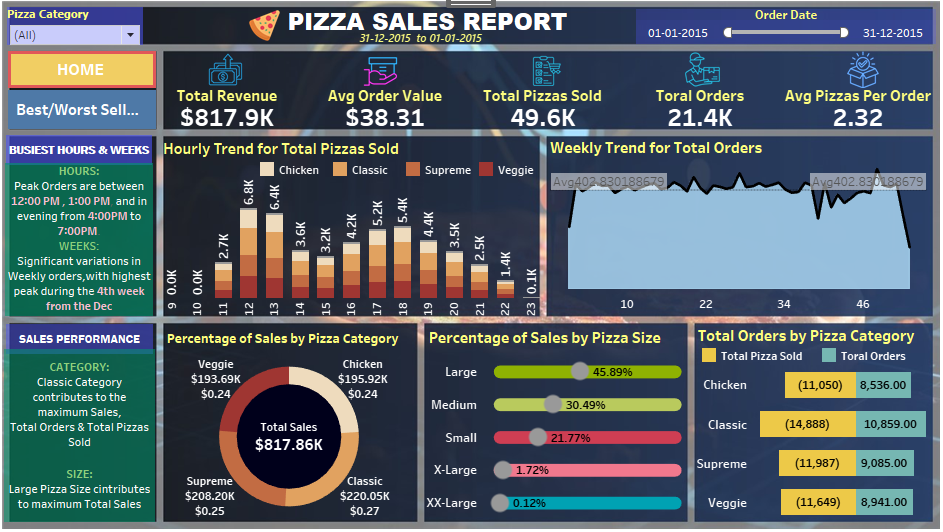
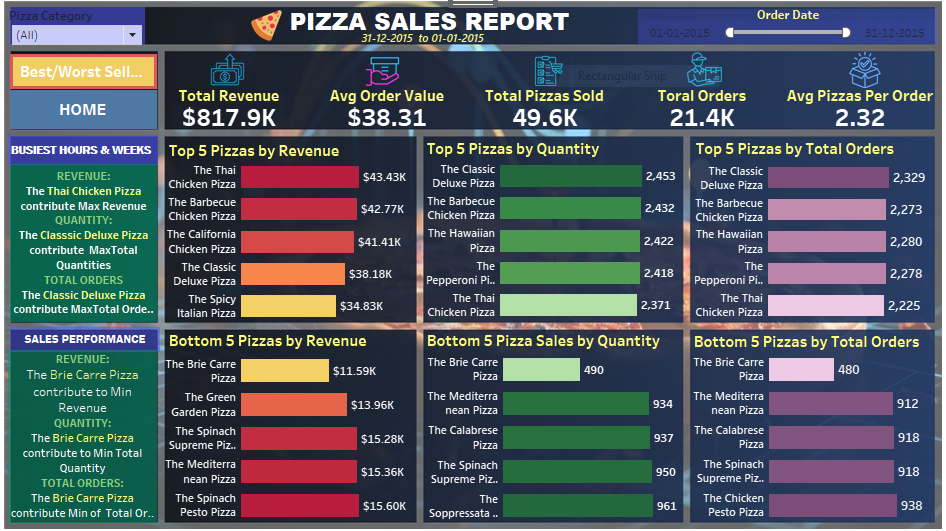

# Pizza Sales(Tableau Dashboard)

# 🍕 Pizza Sales Dashboard 📊

Welcome to the **Pizza Sales Dashboard**, a comprehensive Tableau visualization project that provides deep insights into pizza sales performance across multiple dimensions including time, category, size, revenue, and quantity sold.

This dashboard is built to help restaurant stakeholders, sales analysts, and business managers understand patterns in customer behavior, identify best and worst-performing products, and make data-driven decisions.

---

## 📁 Project Overview

- **Tool Used:** Tableau
- **Data Source:** Pizza sales transaction data (January 1, 2015 - December 31, 2015)
- **Visuals:** Two interactive dashboard pages
- **KPIs Tracked:**
  - Total Revenue
  - Average Order Value
  - Total Pizzas Sold
  - Total Orders
  - Average Pizzas per Order

---

## 🔍 Dashboard 1: Overall Sales Performance

### 📌 Key Metrics (Top Overview Cards)
| Metric | Value |
|--------|--------|
| 💰 Total Revenue | `$817.9K` |
| 🧾 Avg Order Value | `$38.31` |
| 🍕 Total Pizzas Sold | `49.6K` |
| 📦 Total Orders | `21.4K` |
| 🍽️ Avg Pizzas per Order | `2.32` |

---

### 📊 Hourly Trend for Total Pizzas Sold

- Peak sales are recorded:
  - **Afternoon:** 12:00 PM – 1:00 PM
  - **Evening:** 4:00 PM – 7:00 PM
- Visual shows pizza sales by hour segmented into four categories:
  - **Chicken**, **Classic**, **Supreme**, **Veggie**

---

### 📈 Weekly Trend for Total Orders

- Weekly order trends fluctuate throughout the year.
- Highest peaks observed in **week 4** of December.
- Average orders per week: ~403

---

### 🍕 Sales Performance by Category

#### 💡 Key Insights:
- **Classic Pizzas** drive the most sales in terms of both **orders** and **total pizzas sold**.
- **Chicken** and **Veggie** categories are also strong performers.
- **Total Orders by Category:**
  - Classic: 10,859
  - Chicken: 8,536
  - Supreme: 9,085
  - Veggie: 8,941

#### 📦 Total Pizza Sold by Category:
  - Classic: 14,888
  - Chicken: 11,050
  - Supreme: 11,797
  - Veggie: 11,649

---

### 📏 Percentage of Sales by Pizza Size

| Size     | Contribution |
|----------|--------------|
| 🍕 Large     | 45.89%       |
| 🍕 Medium    | 30.49%       |
| 🍕 Small     | 21.77%       |
| 🍕 X-Large   | 1.72%        |
| 🍕 XX-Large  | 0.12%        |

- **Large pizzas** contribute the most revenue and quantity sold.

---

### 💸 Percentage of Sales by Pizza Category

| Category | Revenue Contribution |
|----------|----------------------|
| 🍗 Chicken | $195.92K |
| 🍕 Classic | $220.05K |
| 🥬 Veggie | $193.69K |
| 🍖 Supreme | $208.20K |
| **Total** | **$817.86K** |

---

## 📊 Dashboard 2: Best & Worst Performing Pizzas

This dashboard breaks down individual pizza performance across three metrics: **Revenue**, **Quantity Sold**, and **Total Orders**.

---

### 🏆 Top 5 Pizzas by Revenue

| Pizza | Revenue |
|-------|---------|
| The Thai Chicken Pizza | $43.43K |
| The Barbecue Chicken Pizza | $42.77K |
| The California Chicken Pizza | $41.44K |
| The Classic Deluxe Pizza | $38.18K |
| The Spicy Italian Pizza | $34.83K |

---

### 📦 Top 5 Pizzas by Quantity Sold

| Pizza | Quantity |
|-------|----------|
| The Classic Deluxe Pizza | 2,453 |
| The Barbecue Chicken Pizza | 2,432 |
| The Hawaiian Pizza | 2,428 |
| The Pepperoni Pizza | 2,418 |
| The Thai Chicken Pizza | 2,371 |

---

### 📋 Top 5 Pizzas by Total Orders

| Pizza | Orders |
|-------|--------|
| The Classic Deluxe Pizza | 2,329 |
| The Barbecue Chicken Pizza | 2,273 |
| The Hawaiian Pizza | 2,280 |
| The Pepperoni Pizza | 2,274 |
| The Thai Chicken Pizza | 2,225 |

---

### ❌ Bottom 5 Pizzas by Revenue

| Pizza | Revenue |
|-------|---------|
| The Brie Carre Pizza | $11.59K |
| The Green Garden Pizza | $13.96K |
| The Spinach Supreme Pizza | $15.28K |
| The Mediterran Pizza | $15.56K |
| The Chicken Pesto Pizza | $15.60K |

---

### 📉 Bottom 5 Pizzas by Quantity

| Pizza | Quantity |
|-------|----------|
| The Brie Carre Pizza | 490 |
| The Mediterran Pizza | 934 |
| The Green Garden Pizza | 937 |
| The Spinach Supreme Pizza | 950 |
| The Chicken Pesto Pizza | 961 |

---

### 🚫 Bottom 5 Pizzas by Total Orders

| Pizza | Orders |
|-------|--------|
| The Brie Carre Pizza | 480 |
| The Mediterran Pizza | 912 |
| The Calabrese Pizza | 918 |
| The Spinach Supreme Pizza | 918 |
| The Chicken Pesto Pizza | 921 |

---

## 📅 Time-Based Insights

- **Busiest Hours:**
  - 12:00 PM – 1:00 PM
  - 4:00 PM – 7:00 PM

- **Peak Weekly Activity:**
  - 4th week of December (holiday season surge)

---

## 🏁 Final Insights

- 📈 Focus on **Large Size** and **Classic Category** for highest ROI.
- ❗ Improve or promote bottom-performing pizzas (e.g., **Brie Carre**, **Spinach Supreme**).
- 🕒 Peak hours and holiday weeks are crucial sales drivers – ideal for promotional campaigns.
- 📊 Pizza size and category segmentation are vital for inventory and marketing strategies.

---

## 📌 How to Use

1. Open the `.twbx` Tableau workbook (if shared).
2. Interact with filters (e.g., Pizza Category, Order Date range).
3. Use the **Best/Worst Sellers** tab for individual pizza-level analysis.
4. Hover over charts for tooltip details.

---

## 🎯 Goals Achieved

- Built a dynamic, interactive dashboard for a full year of pizza sales.
- Identified business KPIs and performance trends across product lines.
- Delivered actionable insights for sales improvement and product strategy.

---

## 📷 Dashboard Snapshots

### Page 1 – Overview

### Page 2 – Best/Worst Sellers

---

## 🙌 Author

**Vijayan Naidu**  
👩‍💻 MSc Data Science, Fergusson College, Pune  
📅 Year: 2025  
📫 [LinkedIn Profile (Optional)](https://www.linkedin.com)  
🗂️ GitHub: [vj220803]

---

## ⭐ If you liked this project

Please ⭐ star this repository and share your feedback!
